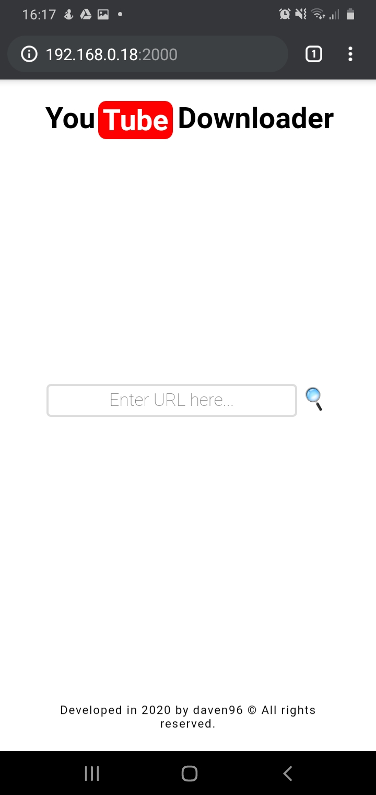
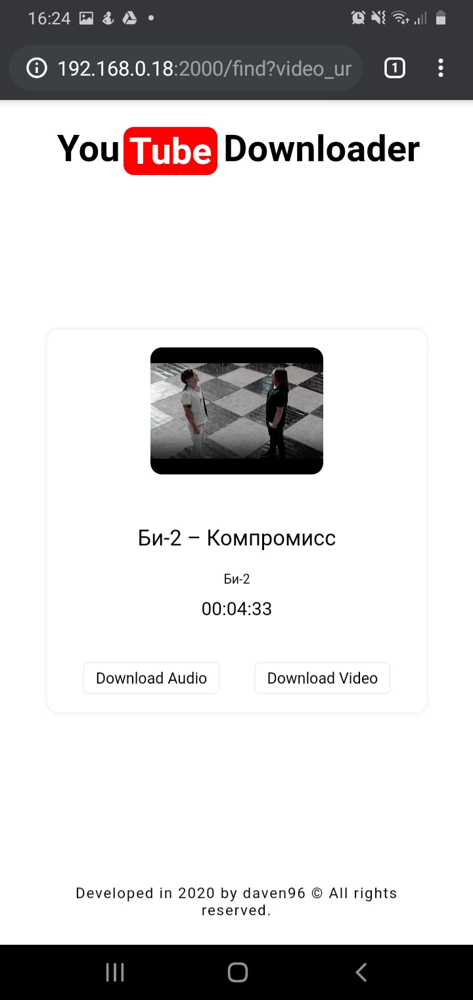
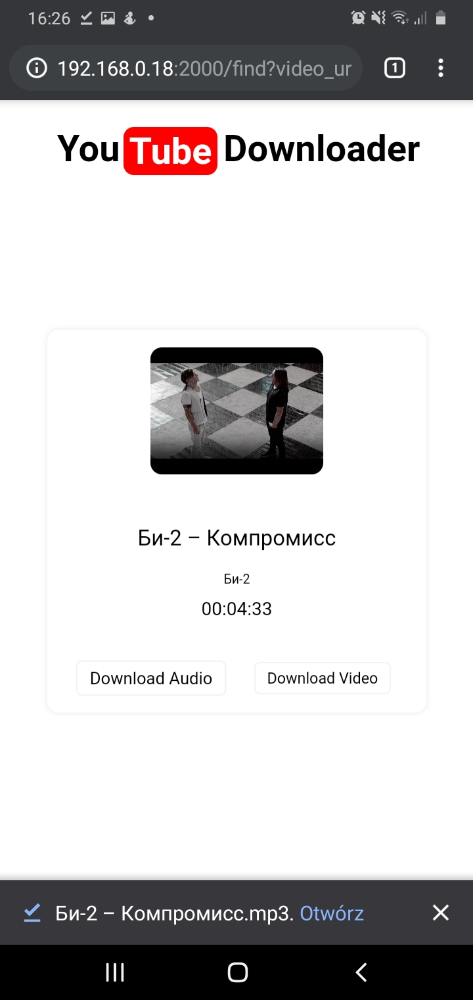

## Youtube audio/video downloader :zap:

---

### What actually this project is :grey_question:

This is a project of application to download audio or video from youtube.
Views for client are generated on server side with PUG view engine.

---

### Requirements :wrench:

- **Node.js ( 13 or newer)**
- **ffmpeg** installed on server (with configured enviroment variables)

---

### How to install application on server :grey_question:

##### 1) Clone this project

##### 2) Run command line

##### 3) Type on CLI

```js
    npm install
```

##### 4) Configure .env file (optional)

##### 5) Type in CLI

```js
    npm start
```

#### Ready to use :rocket:

---

### Application screens :straight_ruler:

#### Desktop version

###### Index page


---

---

###### Info page


---

---

###### Downloaded file


---

#### Mobile version

###### Index page



---

---

###### Info page



---

---

###### Downloading file


###### Downloaded file



---

### UML diagram :triangular_ruler:


